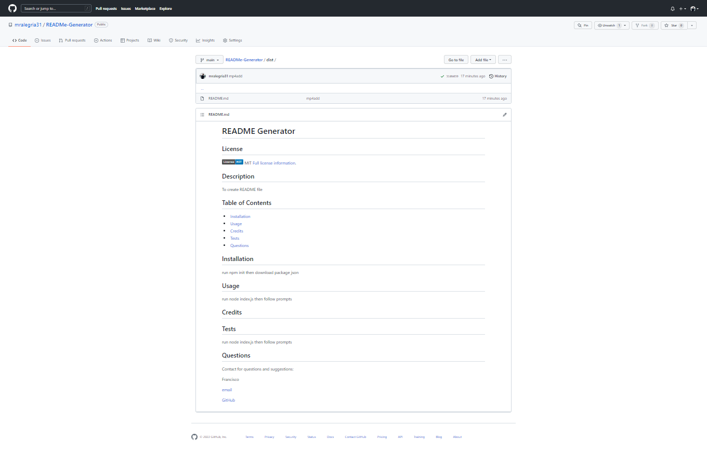

# READMe Generator
## Purpose 
To generate a readme for any assignment.
## Built With
*JavaScript 
*NodeJS
## Screenshot 

## video demo 
https://drive.google.com/file/d/1_dG0Ef9ILICI2E1zLEoOYrclSGfsITO-/view?usp=sharing
## Contribution 
Made by Francisco Alegria 
